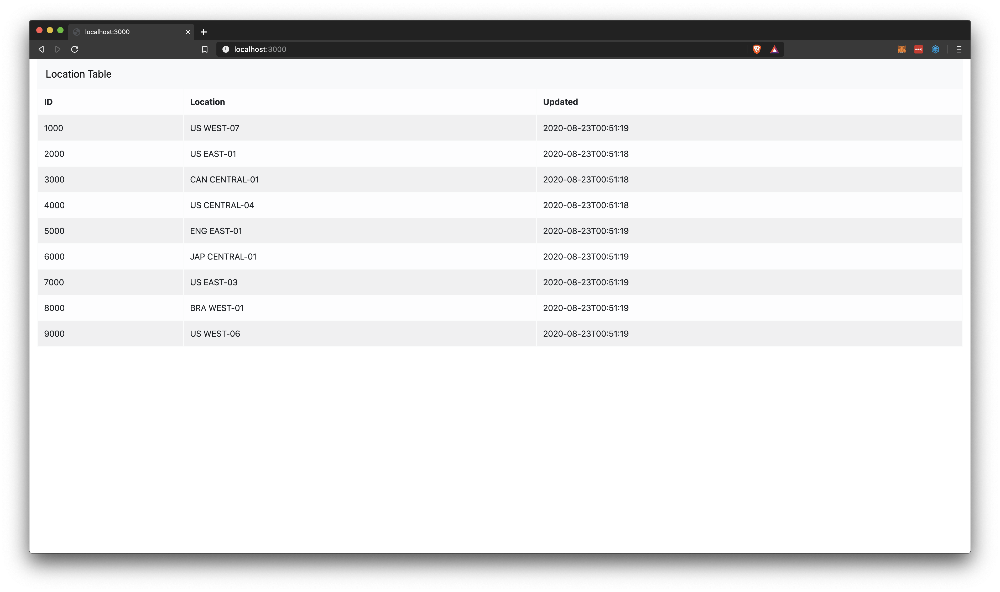

# EOSIO Supply Chain Use Case Example

This project aims to create a simple supply chain provenance tracker. The system will create a local EOSIO network (with Nodeos and Keosd running in Docker containers), a Node.js server, a Next.js web application, and a QR scanner on your local machine. 

Once the system is up and running you can deploy the `tracker` smart contract. The contract creates a multi index table with the following schema:

|Field     |                  Description                   |       Type      |
|----------|------------------------------------------------|-----------------|
|`id`      | ID of item                                     | `uint64_t`      |
|`location`| Last known location of item                    | `string`        |
|`updated` | Timestamp of the last time the item was updated| `time_point_sec`|

The table will keep track of items by their ID. The table will also keep track of the last known location of the item and the time it was last updated. Since the system is using an EOSIO blockchain, the state changes to the table are immutable and tamper proof (of course this isn't entirely true since it's a single node test network). This would allow a user to see instantly the last location the item was. The item location is updated via being scanned by a QR scanner that has been set up and linked to a blockchain account. 

## System Requirements
Currently only built on MacOS. Additionally, this project has the following dependencies:

- Docker for Mac
- EOSIO
- OpenCV
- CMake

## Quick Start

Start an instance of `nodeos`, `keosd`, `nodejs`, and `nextjs` with Docker compose:

```sh
docker-compose up
```

Run the following script:

```sh
./deploy_contract.sh
```

This script will:

1. Ensure `cleos` can comunicate with the instances of `nodeos` and `keosd` running in the Docker containers
2. Creates a wallet
3. Imports the `eosio` development keys
4. Compiles the `tracker` contract
5. Creates an account for the contract called `tracker`
6. Set the contract WASM code
7. Set the contract ABI
8. Create test accounts called `scanner1` and `scanner2`
9. Create nine items using the `create` action
10. View the `location` table in the `tracker` contract to ensure the actions went through
11. Test the `update` action on the item with the ID of `1000`
12. View the table again to see the update
13. Get a historical view of actions from the `tracker` account

Now you should be able to see the web application at [http://localhost:3000/](http://localhost:3000/) where you will see the following:



Now let's create a QR scanner. Navigate to the `qrscanner` directory:

```sh
cd qrscanner/
```

Now run the `create_scanner` script:

```sh
./scripts/create_scanner.sh
```

You'll be greeted with the following prompt:

```
+------------------------------------------------------+
|                       Welcome                        |
+------------------------------------------------------+
| Account Name: 1-12 character name of the             |
|               corresponding blockchain account       |
|                                                      |
| Country Code: 2-3 character ISO country code (ex: US)|
|                                                      |
| Region: Region within the country that the scanner   |
|         will reside. Region with 2-3 digit zone.     |
|         Example: WEST-03, EAST-01, CENTRAL-08        |
+------------------------------------------------------+

Enter account name for the scanner: 
```

Now follow these directions:

1. For the account name prompt enter `scanner1`
2. For the country code enter `US`
3. For the region enter `EAST-03`
4. Make sure you see the following to confirm your input:

```
Account name: scanner1
Location:     US EAST-03
```

5. If everything looks good press `y` and then press `enter`

The QR scanner application will start to compile. Once you see that it is 100% compiled run the following:

```sh
./scripts/start_scanner.sh 
```

This will start the scanner and you should see a new window showing you feed from your webcam. For this example I have one of the QR code images provided in the `qrscanner/example-qr-img/` directory. Specifically, I used the one labeled `4000.png`. This is the QR code for the item with the ID of `4000`. When I held up the QR code to the webcam on my phone, the OpenCV QR decoder recognized the QR, parsed it and sent a post request to the `nodejs` server. 


This post request contained the following payload:

|Field     |Description                                                                                     |
|----------|------------------------------------------------------------------------------------------------|
|`id`      | The item ID encoded in the QR code                                                             |
|`account` | The blockchain account associated with the QR scanner that we created (`scanner1` in this case)|
|`location`| The location of the QR scanner that we created (`US EAST-03` in this case)                     |

If you go back to the web app at [http://localhost:3000/](http://localhost:3000/) and look at the row where the ID number is `4000` you will see that the location has changed from `US CENTRAL-04` to `US EAST-03` and the `Updated` cell has been updated to the timestamp of the transaction. 


Now try to do the same with the other two QR example images in the `qrscanner/example-qr-img` (the ones labeled `3000.png` and `5000.png`) to see those items being updated as well. 

Once you're done make sure you remove the QR scanner so you can do the tutorial again if you'd like. To do so navigate back to the `qrscanner/` directory:

```sh
cd qrscanner/
```

Now run the `destroy_scanner` script:

```sh
./scripts/destroy_scanner.sh
```

You will be met with the following prompt:

```sh
WARNING: THIS WILL DELETE ALL SCANNER CONFIG DATA

Do you want to delete all scanner config data and remove the program from this machine? [y/n] 
```

As the prompt warns, this will delete the config file that was created when we set up the node. It will also remove the build directory of the QR scanner. 

Go ahead and press `y` and hit `enter`. This will confirm that you want to remove the QR scanner files.

Now, bring down the Docker containers using the following command:

```sh
docker-compose down
```

You should see the following which will confirm that the containers have been stopped:

```sh
Stopping nextjs ... done
Stopping keosd  ... done
Stopping nodeos ... done
Stopping nodejs ... done
Removing nextjs ... done
Removing keosd  ... done
Removing nodeos ... done
Removing nodejs ... done
```

Now, everything should be the same as it was before you started the quick start tutorial. Feel free to play around with the code and see how everything works under the hood. If you ran into any issues let me know by creating an issue.

## Wiki
[Wiki](https://github.com/mharrisb1/eosio-qr-supply-chain-example/wiki)

## License

[MIT](./LICENSE)